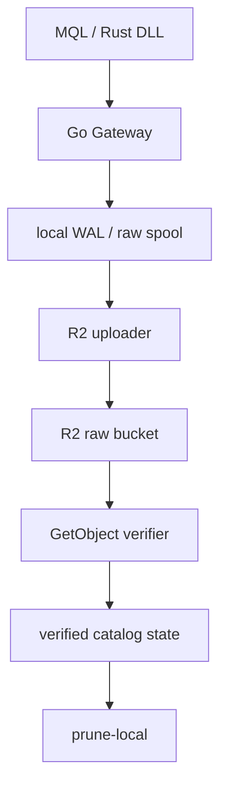
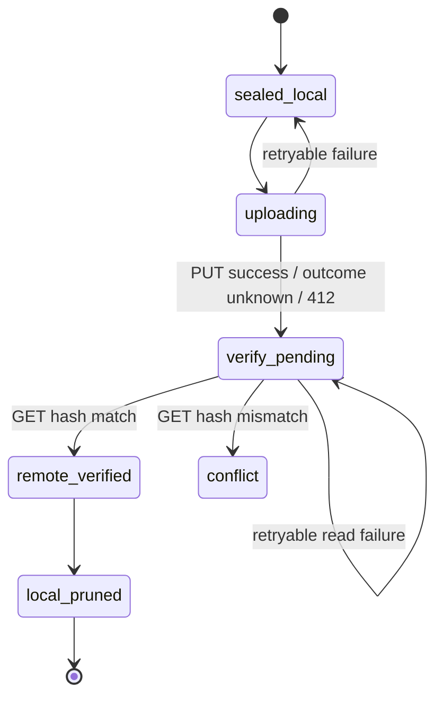

# Tick Gateway — Cloudflare R2アップロード／Windows認証仕様書

- 文書バージョン: 1.0
- 状態: 実装着手可能
- 対象OS: Windows 10/11、Windows Server 2019以降
- 実装言語: Go
- 最終更新: 2026-07-16

## 1. この文書の使い方

本書はCodexへ渡す実装仕様である。本文中の「必須」は受入条件、「推奨」は合理的な理由がない限り採用する条件、「任意」は将来拡張を表す。

Codexは、既存コードと本書が衝突した場合に黙って仕様を弱めてはならない。衝突箇所、影響、代替案を提示して判断を求めること。既存のローカルWAL／raw spool形式と状態保存機構は可能な限り維持すること。

## 2. 決定事項

| 項目 | 決定 |
| --- | --- |
| R2クライアント | AWS SDK for Go v2 |
| Goパッケージ | `github.com/aws/aws-sdk-go-v2/config`、`credentials`、`service/s3` |
| R2認証 | 対象バケットだけに限定したR2 Account API token（Object Read & Write） |
| 認証方式 | Access Key ID + Secret Access KeyによるS3 SigV4 |
| Windowsでの秘密保持 | DPAPI `CRYPTPROTECT_LOCAL_MACHINE` + `CRYPTPROTECT_UI_FORBIDDEN` + NTFS ACL |
| 秘密の注入 | DPAPI暗号化バンドルのファイルパスを設定する。平文の環境変数は使わない |
| Wrangler | 実行時依存にしない。初期設定にも必須ではない |
| rclone | 正常系、整合性判定、prune判定から除外する |
| 上書き防止 | 単一PUTで `IfNoneMatch: "*"` を必須とする |
| R2上の実体確認 | `GetObject`を最後まで読み、サイズとSHA-256をローカル値と照合する |
| ローカル削除 | remote verification完了後だけ許可する |
| キーローテーション | v1では自動化しない。新規トークン発行による手動入替を実装する |
| multipart | v1の必須範囲外。追加時も同じAWS SDKを使う |

CloudflareはAWS SDK for Go v2とR2固有endpoint、`region=auto`、明示的なS3認証情報を使う構成を案内している。R2 Account API tokenはCloudflareアカウントに紐づき、手動で失効するまで有効である。[Cloudflare: AWS SDK for Go](https://developers.cloudflare.com/r2/examples/aws/aws-sdk-go/) / [Cloudflare: R2 Authentication](https://developers.cloudflare.com/r2/api/tokens/)

## 3. 目的

以下を満たすWindows常駐Gatewayを実現する。

1. MQL／Rust DLLから受け取ったtick rawデータを、まずローカルの耐久領域へ確定する。
2. 確定済みファイルをCloudflare R2へ冪等にアップロードする。
3. R2から読み戻した内容がローカルと一致すると確認する。
4. 確認済みのローカルデータだけを`prune-local`の対象にする。
5. Windowsサービスとして対話ログインなしに再起動後も動作する。
6. R2秘密情報を設定ファイル、環境変数、コマンドライン、ログへ平文で残さない。

## 4. 非目的

v1では以下を実装しない。

- `wrangler login`のOAuthセッションをAWS SDKへ流用すること
- Wranglerやrcloneを子プロセスとして呼び出すこと
- Cloudflareの一時クレデンシャルを自動発行すること
- API tokenの自動ローテーション
- 複数バケットへの同一資格情報での書込み
- R2をローカルWALの代わりに使うこと
- R2 ETagをコンテンツハッシュとして信用すること
- R2オブジェクトをGatewayから削除すること

## 5. 全体アーキテクチャ



責務の境界は以下とする。

- 受信処理はR2の可用性に依存せず、ローカル確定までを担当する。
- uploaderはsealed済みファイルだけを読む。
- verifierはR2からの全量読戻しとハッシュ照合を担当する。
- prunerは`remote_verified`状態だけを入力とし、R2 APIを直接呼ばない。
- ネットワーク障害、認証切れ、R2障害の間も収集を継続し、spoolに滞留させる。

## 6. R2の事前準備

### 6.1 バケット

運用者がCloudflare Dashboardでtick raw専用バケットを作成する。アプリケーションはバケットを作成・削除してはならない。

本番ではrawオブジェクト用prefix（既定値`raw/v1/`）へBucket Lockを設定することを必須とする。保持期間は業務要件で決め、アプリへハードコードしない。資格情報の検査に使う`health/` prefixは、検査オブジェクトを削除できるようraw用ロックの対象外とする。Bucket Lockはprefix単位で期間または無期限の保持規則を設定できる。[Cloudflare: Bucket locks](https://developers.cloudflare.com/r2/buckets/bucket-locks/)

### 6.2 Account API token

Cloudflare Dashboardで次の条件のトークンを事前発行する。

1. `Storage & databases > R2 > Overview > Manage API Tokens`を開く。
2. `Create Account API token`を選ぶ。
3. 権限を`Object Read & Write`にする。
4. `Apply to specific buckets only`でtick rawバケットだけを選ぶ。
5. 発行時に一度だけ表示されるAccess Key IDとSecret Access Keyを安全に受け取る。

Admin権限や全バケット対象のトークンをGatewayへ与えてはならない。通常のアップロードと読戻しを同一プロセスが行うため、v1ではwrite用／read用資格情報を分離しない。

Account API tokenは手動失効まで有効で、Secret Access Keyの再表示・同一トークン内での再生成はできない。漏えい・定期交換時は新しいトークンを発行して入れ替える。[Cloudflare: R2 Authentication](https://developers.cloudflare.com/r2/api/tokens/)

### 6.3 Endpoint

設定にはAccount IDからの組立値ではなく、完全なendpoint URLを保持する。

```text
https://<ACCOUNT_ID>.r2.cloudflarestorage.com
```

jurisdiction固有バケットに対応できるよう、endpointはコードに固定しない。TLSを使わないendpoint、URLにuserinfo・query・fragmentを含むendpointは設定エラーとする。regionは`auto`固定とする。

### 6.4 Wranglerとの関係

Wranglerは本仕様の前提ではない。`wrangler login`はWrangler自身がCloudflare操作に使うOAuth認証であり、AWS SDKが必要とするAccess Key ID／Secret Access Keyを提供しない。

Bucket Lockなどを運用者がWranglerで設定してもよいが、同じ操作はDashboardまたはCloudflare APIでも行える。Gatewayのインストール、起動、通常アップロード、検証、pruneにWranglerを必要としてはならない。

## 7. Windowsの配置と権限

### 7.1 既定パス

| 用途 | 既定パス |
| --- | --- |
| 実行ファイル | `C:\Program Files\TickGateway\tick-gateway.exe` |
| 非秘密設定 | `C:\ProgramData\TickGateway\config.toml` |
| DPAPI暗号化資格情報 | `C:\ProgramData\TickGateway\secrets\r2-writer.dpapi` |
| spool | `C:\ProgramData\TickGateway\spool\` |
| WAL／状態カタログ | `C:\ProgramData\TickGateway\wal\` |
| ログ | `C:\ProgramData\TickGateway\logs\` |

### 7.2 サービスID

Windowsサービス名は`TickGateway`、表示名は`Tick Gateway`とする。サービスのログオンアカウントは原則`NT AUTHORITY\LocalService`とし、per-service SIDを有効にする。

```text
sc.exe sidtype TickGateway unrestricted
```

サービスに管理者権限を与えてはならない。対話ログオンも不要とする。

### 7.3 ACL

`secrets`ディレクトリと資格情報ファイルは継承を無効化し、少なくとも次だけを許可する。

| Principal | 権限 |
| --- | --- |
| `NT AUTHORITY\SYSTEM` | Full control |
| `BUILTIN\Administrators` | Full control |
| `NT SERVICE\TickGateway` | Read |

一般ユーザー、`Users`、`Authenticated Users`、`Everyone`へ権限を与えてはならない。インストーラーはACL設定後に実効ACLを検査し、過剰なACEがある場合は失敗させる。

spool／WALは`NT SERVICE\TickGateway`へModifyを許可する。実行ファイルと設定ファイルはサービスからReadのみとする。

## 8. 資格情報の保持

### 8.1 DPAPI方式

資格情報は次のJSONをUTF-8で直列化した後、Windows DPAPIで暗号化する。

```json
{
  "format_version": 1,
  "access_key_id": "<R2_ACCESS_KEY_ID>",
  "secret_access_key": "<R2_SECRET_ACCESS_KEY>",
  "created_at": "2026-07-16T00:00:00Z",
  "label": "tick-r2-writer"
}
```

DPAPI呼出しは次を満たすこと。

- `CryptProtectData`／`CryptUnprotectData`を使用する。
- フラグに`CRYPTPROTECT_LOCAL_MACHINE | CRYPTPROTECT_UI_FORBIDDEN`を指定する。
- UIプロンプトを使用しない。
- DPAPI出力バッファは`LocalFree`で解放する。
- 復号済みbyte sliceは利用終了後にゼロクリアする。ただしGoの複製・GCの性質上、完全消去を保証するとは表現しない。

`CRYPTPROTECT_LOCAL_MACHINE`では同じマシンの別ユーザーも復号可能なため、機密性の実質的な境界はNTFS ACLである。DPAPIだけでサービス固有の隔離が成立すると仮定してはならない。[Microsoft: CryptProtectData](https://learn.microsoft.com/en-us/windows/win32/api/dpapi/nf-dpapi-cryptprotectdata)

### 8.2 書込みの原子性

資格情報更新は次の順序で行う。

1. 同一ディレクトリに予測困難な名前の一時ファイルを作る。
2. 作成時から最終ACL相当の制限を適用する。
3. DPAPI暗号文を書き、ファイルをflushする。
4. 暗号文を同じコードで復号し、構造と値を検査する。
5. Windowsの置換APIで`r2-writer.dpapi`へ原子的に昇格する。
6. 親ディレクトリのACLを再検査する。

平文の一時ファイルを作ってはならない。更新途中で停止しても、旧ファイルまたは新ファイルのどちらかが完全な状態で残らなければならない。

### 8.3 禁止事項

次の保持方法は禁止する。

- `AWS_ACCESS_KEY_ID`、`AWS_SECRET_ACCESS_KEY`などのシステム環境変数
- `TICK_R2_WRITER_SECRET_ACCESS_KEY`のような平文環境変数
- `.env`、TOML、JSON、YAML、レジストリへの平文保存
- Windowsサービスの起動引数への秘密埋込み
- CLI引数でSecret Access Keyを受け取ること
- Wranglerの認証ファイルを読み取ること
- ログ、panic、エラー、メトリクス、クラッシュダンプへ秘密を出すこと

設定可能にするのは資格情報ファイルのパスだけとする。互換性が必要な場合は`TICK_R2_CREDENTIALS_FILE`を認めてよいが、その値はDPAPIファイルのパスであり秘密そのものではない。

## 9. 設定仕様

`config.toml`の例:

```toml
[r2]
endpoint = "https://<ACCOUNT_ID>.r2.cloudflarestorage.com"
region = "auto"
bucket = "tick-raw"
raw_prefix = "raw/v1/"
health_prefix = "health/"
credentials_file = 'C:\ProgramData\TickGateway\secrets\r2-writer.dpapi'
single_put_max_bytes = 536870912

[upload]
workers = 2
request_timeout = "5m"
verify_timeout = "10m"
retry_min = "1s"
retry_max = "5m"

[storage]
spool_dir = 'C:\ProgramData\TickGateway\spool'
wal_dir = 'C:\ProgramData\TickGateway\wal'
```

条件:

- `region`は省略時も`auto`とし、別値を拒否する。
- `bucket`とprefixは空を拒否する。
- `raw_prefix`と`health_prefix`は重複させない。
- `workers`は小さい既定値から開始し、上限を設ける。
- v1の`single_put_max_bytes`既定値は512 MiBとする。
- 上限を超えるファイルは失敗扱いで削除せず、`multipart_required`として滞留・通知する。
- endpoint、bucket、prefix、ファイルパスはログ出力可。資格情報は不可。

## 10. AWS SDK for Go v2の初期化

必須依存:

```text
github.com/aws/aws-sdk-go-v2/aws
github.com/aws/aws-sdk-go-v2/config
github.com/aws/aws-sdk-go-v2/credentials
github.com/aws/aws-sdk-go-v2/service/s3
```

初期化方針:

```go
cfg, err := config.LoadDefaultConfig(ctx,
    config.WithRegion("auto"),
    config.WithCredentialsProvider(
        credentials.NewStaticCredentialsProvider(accessKeyID, secretAccessKey, ""),
    ),
)

client := s3.NewFromConfig(cfg, func(o *s3.Options) {
    o.BaseEndpoint = aws.String(endpoint)
})
```

条件:

- OSのAWS共有設定や既定credential chainへフォールバックしない。
- session tokenはv1では空文字とする。
- endpointは明示設定だけを使用する。
- 独自HTTPクライアントを使う場合もTLS証明書検証を無効にしない。
- SDKのretryに加えてジョブ単位の永続retryを持つ。ただし同一レイヤーで過剰な多重retryを発生させない。
- AWS本体のendpointへ接続するコードパスを作らない。

## 11. オブジェクトキー

キーはsealed時点で一度だけ決め、状態カタログへ永続化する。再試行時に生成し直してはならない。

推奨形式:

```text
raw/v1/<source-id>/<yyyy>/<mm>/<dd>/<start-utc>-<end-utc>-<sha256>.<ext>
```

条件:

- SHA-256は小文字hexの64文字とする。
- 日時はUTCとする。
- `source-id`は許可文字を定義し、`..`、空要素、先頭slash、backslashを拒否する。
- 同一内容・同一sourceの再処理は同一キーになるようにする。
- キーとローカルパスを混同しない。

SHA-256をキーへ含められない既存命名規則を維持する場合も、状態カタログには必ずSHA-256を保持する。

## 12. 状態モデル

最低限、各sealedファイルについて以下を永続化する。

```text
local_path
object_key
size_bytes
sha256_hex
content_type
state
attempt_count
last_error_class
last_attempt_at
remote_etag
remote_verified_at
```

状態遷移:



条件:

- `uploading`はプロセス停止後に再開可能でなければならない。
- PUTタイムアウトは「失敗」ではなく「結果不明」と扱い、同じキーを検証する。
- `412 PreconditionFailed`は既存オブジェクトの存在を示すだけで、成功とはみなさない。必ず検証へ進む。
- remoteのサイズまたはSHA-256が不一致なら`conflict`とし、自動上書き・自動削除・ローカルpruneを禁止する。
- 状態遷移は次工程を開始する前に耐久化する。

## 13. アップロード仕様

### 13.1 前提

アップロード対象は次をすべて満たすこと。

- writerがclose済みで内容が今後変化しない。
- sealed状態が永続化済み。
- ファイルサイズとSHA-256が計算・永続化済み。
- サイズが`single_put_max_bytes`以下。

アップロード中にファイルのサイズ、mtime、file identityが変わった場合は処理を中止し、データ競合として隔離する。

### 13.2 PutObject

単一PUTは概ね次を使う。

```go
out, err := client.PutObject(ctx, &s3.PutObjectInput{
    Bucket:      aws.String(bucket),
    Key:         aws.String(objectKey),
    Body:        body,
    ContentType: aws.String(contentType),
    IfNoneMatch: aws.String("*"),
    Metadata: map[string]string{
        "sha256": sha256Hex,
    },
})
```

`If-None-Match: *`対応はR2のPutObject互換仕様に含まれる。[Cloudflare: S3 API compatibility](https://developers.cloudflare.com/r2/api/s3/api/)

条件:

- `IfNoneMatch`を外すfallbackを作らない。
- ETagは監査用に保存してよいが、MD5やSHA-256として比較しない。
- Bodyはファイルからstreamし、全体をメモリへ読み込まない。
- Content-LengthをSDKが確定できる入力を使う。
- 成功応答、412、応答不明のいずれも検証フェーズへ進める。
- 401/403は認証・権限エラーとして長いbackoffにし、資格情報交換を促す。

R2は成功を返す前にデータを永続化し、強整合なread-after-writeを提供する。ただし本システムではローカル削除の安全条件として、さらに全量の読戻し検証を要求する。[Cloudflare: Durability](https://developers.cloudflare.com/r2/reference/durability/) / [Cloudflare: Consistency model](https://developers.cloudflare.com/r2/reference/consistency/)

### 13.3 検証

検証は`GetObject`で実施する。

1. 対象キーへ`GetObject`する。
2. response bodyを最後までstreamしながらSHA-256とbyte数を計算する。
3. bodyの`Close`エラーも処理する。
4. byte数を`size_bytes`と比較する。
5. SHA-256を`sha256_hex`と定数時間比較する。
6. 両方一致した場合だけ`remote_verified`へ遷移する。

条件:

- Metadataの`sha256`一致だけでは検証完了にしない。
- HEADだけでは検証完了にしない。
- 途中まで読んだRange GETでは検証完了にしない。
- ETag一致だけでは検証完了にしない。
- GETが404の場合はPUT再試行候補とする。
- GETが5xx／timeoutの場合はverifyを再試行し、即座にPUTし直さない。
- hash不一致は自動retryで解消する通信エラーとみなさず、`conflict`で停止する。

### 13.4 冪等性

以下の結果を満たすこと。

| 状況 | 動作 |
| --- | --- |
| 初回PUT成功 | GET検証し、一致時のみ完了 |
| PUT成功後に応答消失 | GET検証し、一致時は完了 |
| 同じファイルを再実行 | PUTが412でもGET一致なら完了 |
| 同じキーに別内容が存在 | GET不一致で`conflict`、上書き禁止 |
| R2に存在せずGET 404 | 同一キー／同一内容でPUT再試行 |

## 14. prune-local仕様

`prune-local`は次をすべて満たすレコードだけを対象にする。

- stateが`remote_verified`
- `remote_verified_at`が存在する
- 永続化された`size_bytes`と`sha256_hex`が存在する
- 対象ファイルが現在のactive writerに使われていない
- 設定されたローカル保持猶予期間を経過している

prune前にR2へ再問い合わせする必要はない。検証結果を耐久状態として扱う。削除成功後に`local_pruned`を永続化する。ファイルが既にない場合も監査ログを残し、状態を収束させる。

`conflict`、`verify_pending`、`multipart_required`、認証エラー中のファイルは、ディスク逼迫時でも自動削除してはならない。

## 15. retryと障害時動作

retryはfull jitter付きexponential backoffを使い、最小1秒、最大5分を既定とする。永続キューに次回実行時刻を保存し、サービス再起動でretry回数がリセットされないようにする。

| 分類 | 例 | 動作 |
| --- | --- | --- |
| retryable | timeout、接続断、429、5xx | backoffして再試行 |
| auth | 401、403 | アラート、長いbackoff、spool保持 |
| precondition | 412 | 既存remoteを検証 |
| not found during verify | 404 | PUT再試行へ戻す |
| conflict | size/hash不一致 | 自動停止、手動対応 |
| local corruption | sealed後のサイズ/hash変化 | 隔離、R2へ送らない |
| unsupported size | v1上限超過 | `multipart_required`、保持・通知 |

サービス停止時は新規ジョブ受付を止め、実行中streamをcontext cancellationで終了し、状態を再開可能な形で残す。停止待ち時間を超えてもローカルファイルを削除しない。

## 16. CLI仕様

### 16.1 `credentials set`

```text
tick-gateway.exe credentials set --config <path>
```

- Access Key IDとSecret Access Keyを対話入力する。
- Secretは画面へechoしない。
- Secretを引数・環境変数で受け取らない。
- DPAPI暗号化ファイルを原子的に作成／更新する。
- 成功時も秘密、部分文字列、長さを表示しない。
- 管理者権限がない、またはACLを安全に設定できない場合は失敗する。

自動インストール向けの非対話入力が必要になった場合は、名前付きパイプまたはACL済み一時ハンドルなど別仕様を設計する。v1でstdin redirectを安易に追加しない。

### 16.2 `r2 doctor`

```text
tick-gateway.exe r2 doctor --config <path>
```

次を検査する。

1. config構文とendpoint制約
2. 資格情報ファイルのACL
3. DPAPI復号
4. `health/<machine-id>/<uuid>`へ`IfNoneMatch: *`で小さいランダムデータをPUT
5. GetObjectで全量hash照合
6. health prefixがロック対象外なら検査オブジェクトを削除

削除できない場合でも検査本体の成功／失敗とcleanup失敗を区別する。raw prefixには検査オブジェクトを置かない。

### 16.3 `credentials status`

秘密を復号して画面表示せず、次だけを返す。

- ファイルの存在
- ACL検査結果
- DPAPI復号可否
- format version
- label
- created_at
- 稼働サービスが資格情報を読めるか

## 17. 手動キーローテーション

v1に自動ローテーションはない。DPAPIは保存時暗号化であり、R2キーを交換する機能ではない。

交換手順:

1. Cloudflareで同じバケット・同じ最小権限の新しいAccount API tokenを発行する。
2. 旧トークンをまだ失効しない。
3. 新資格情報をstaging用DPAPIファイルへ保存する。
4. `r2 doctor`を新資格情報に対して実行し、PUT／GET検証を成功させる。
5. 本番資格情報ファイルへ原子的に昇格する。
6. Windowsサービスを再起動する。
7. backlogのアップロード／検証が進むことを確認する。
8. Cloudflareで旧トークンを手動失効する。

交換失敗時にも収集はspoolへ継続し、未検証ファイルを削除してはならない。旧トークン失効前に新トークンを検証するoverlap方式を必須とする。

自動ローテーションが将来必要になった場合は、Cloudflare R2 Temporary Credentialsと親トークンを保持するcredential brokerを別設計する。短期資格情報も親資格情報を必要とするため、単体Gatewayへ導入しても秘密保持問題そのものは消えない。[Cloudflare: Temporary credentials](https://developers.cloudflare.com/r2/api/s3/temporary-credentials/)

## 18. multipartの将来仕様

v1では512 MiBを超えるファイルをアップロードせず、ローカルに保持する。spool segmentの通常サイズはこの閾値未満になるよう別途設定する。

multipart追加時の必須条件:

- AWS SDK for Go v2のS3 multipart APIまたは同SDK準拠のmanagerを使う。
- upload ID、part番号、part ETagを耐久状態として保持する。
- 再起動後に再開または安全にAbortできる。
- multipart完了後もGetObject全量SHA-256検証を行う。
- CompleteMultipartUploadに単一PUTの`IfNoneMatch: *`と同等の保護があると仮定しない。
- object keyへSHA-256を含めるか、単一writer制約と事前存在確認を組み合わせ、別内容の上書きを設計上不可能にする。
- multipart ETagをコンテンツハッシュにしない。

## 19. ログとメトリクス

### 19.1 ログ

構造化ログへ次を含める。

- event名
- object key
- ローカルレコードID
- size
- attempt count
- state遷移
- HTTP status／R2 error code
- latency
- error class

ログへ含めないもの:

- Access Key ID
- Secret Access Key
- Authorization header
- SigV4署名
- session token
- DPAPI復号内容
- リクエスト／SDK構造体の無加工dump

### 19.2 メトリクス

最低限、次を公開する。

```text
tick_spool_files
tick_spool_bytes
tick_upload_attempts_total{result}
tick_upload_latency_seconds
tick_verify_attempts_total{result}
tick_verify_latency_seconds
tick_remote_verified_total
tick_upload_conflicts_total
tick_oldest_unverified_age_seconds
tick_pruned_files_total
tick_auth_errors_total
```

ラベルへobject key、ローカルパス、source-idなど高カーディナリティ値を入れない。

## 20. セキュリティ要件

- R2 tokenはtick rawバケット限定にする。
- uploaderのコードにDeleteObject／DeleteObjectsを実装しない。
- raw prefixへBucket Lockを設定する。
- ローカル秘密はDPAPI + ACLで保護する。
- Gatewayは低権限Windowsサービスとして動かす。
- endpoint allowlistは`https`かつ明示設定を最低条件とし、必要なら組織ポリシーでhostname suffixも制限する。
- proxyを使う場合、Proxy-Authorizationをログへ出さない。
- 設定、ACL、資格情報の異常時はfail closedとし、R2送信とpruneを止める。ただしローカル収集は可能な限り継続する。
- R2読戻しデータを実行・展開・解釈せず、hash streamとして扱う。

管理者権限を持つ利用者やOS全体を侵害した攻撃者から秘密を守ることは本仕様の脅威モデル外とする。DPAPIマシン保護とACLは、一般ユーザーや偶発的な設定露出に対する防御である。

## 21. テスト要件

### 21.1 単体テスト

- config validation
- endpoint validation
- object key generation／sanitization
- 状態遷移の許可・拒否
- retry分類とbackoff
- 412を成功扱いしないこと
- ETagをhashとして使わないこと
- prune eligibility
- log redaction
- credential bundleのversion validation

Windows build tag付きテスト:

- DPAPI encrypt/decrypt round trip
- 異なるentropy／破損blobの失敗
- UIなしで実行できること
- 原子的資格情報置換
- ACL検査

### 21.2 統合テスト

R2の専用テストバケットまたは互換テスト環境で次を確認する。

1. 新規PUT → GET hash一致 → verified
2. 同一キー・同一内容 → 412 → GET一致 → verified
3. 同一キー・別内容 → 412 → GET不一致 → conflict
4. PUT応答消失を模擬 → GET一致 → verified
5. GET途中切断 → pruneされずverify再試行
6. 401／403 → spool保持
7. サービス再起動 → 永続キューから再開
8. verified前はprune不可
9. verified後かつ猶予期間後だけprune可
10. 秘密がログ、環境変数、コマンドラインへ出ない

### 21.3 障害注入

- R2到達不能
- DNS失敗
- TLS失敗
- ディスクfull
- spoolファイル変更
- WAL書込み失敗
- DPAPIファイル破損
- ACL過剰許可
- 資格情報更新途中のプロセスkill
- prune途中のプロセスkill

## 22. 受入条件

以下がすべて満たされたとき完了とする。

- Windowsサービスとして対話ログインなしで起動できる。
- Wranglerとrcloneが未インストールでも全機能が動く。
- R2資格情報がDPAPI暗号化ファイル以外へ平文保存されない。
- サービス以外の一般ユーザーが資格情報ファイルを読めないACLになっている。
- AWS SDK for Go v2がR2 endpoint、region `auto`、static credentialsで初期化される。
- PutObjectが常に`IfNoneMatch: "*"`を送る。
- 412／timeout ambiguityでremote検証へ進む。
- GetObjectの全量サイズ・SHA-256一致だけが`remote_verified`を作る。
- hash不一致時に上書き・pruneしない。
- `remote_verified`以前のローカルファイルをpruneしない。
- サービス再起動後に未完了状態を正しく再開する。
- 認証失敗中もローカル収集データを保持する。
- 手動資格情報交換が、旧トークンの事前失効なしに検証・昇格できる。
- 全テストがrace detectorを含めて通る（Windowsで実行可能な範囲）。

## 23. Codex向け実装順序（ExecPlan）

1. 既存repoを調査し、収集、sealed判定、WAL、pruneの現在の責務とテストを一覧化する。
2. 本書との差分と、変更対象パッケージ／ファイルをExecPlanへ記載する。
3. R2 config、credential provider interface、DPAPI Windows実装を追加する。
4. `credentials set/status`とACL検査を実装する。
5. AWS SDK for Go v2 client factoryを実装する。
6. uploaderと永続状態遷移を実装する。
7. GetObject stream verifierを実装する。
8. prune条件を`remote_verified`へ接続する。
9. `r2 doctor`を実装する。
10. retry、停止処理、ログredaction、メトリクスを追加する。
11. 単体・統合・障害注入テストを追加し、既存テストを復旧する。
12. Windowsサービスとして実機相当環境でインストール、再起動、資格情報交換を検証する。
13. 実装結果、未解決事項、運用手順、テスト証跡を報告する。

Codexは実装開始前に、特に次の3点をシニア／アーキテクト観点でレビューすること。

- 状態遷移がクラッシュ後も安全か
- 412／timeout ambiguity／hash mismatchで上書きや誤pruneが起きないか
- DPAPI、ACL、WindowsサービスIDの組合せが実環境で成立するか

## 24. 未確定の運用パラメータ

実装を止める未確定事項ではないが、本番投入前に運用者が決める。

- raw Bucket Lockの保持期間
- ローカルpruneまでの猶予期間
- spool容量の警告・停止閾値
- source-id命名規則
- rawファイル拡張子とContent-Type
- サービス停止タイムアウト
- キー手動交換の運用周期
- health prefixの検査オブジェクト保持方針

## 25. 参考資料

- [Cloudflare R2 — Authentication](https://developers.cloudflare.com/r2/api/tokens/)
- [Cloudflare R2 — AWS SDK for Go](https://developers.cloudflare.com/r2/examples/aws/aws-sdk-go/)
- [Cloudflare R2 — S3 API compatibility](https://developers.cloudflare.com/r2/api/s3/api/)
- [Cloudflare R2 — Consistency model](https://developers.cloudflare.com/r2/reference/consistency/)
- [Cloudflare R2 — Durability](https://developers.cloudflare.com/r2/reference/durability/)
- [Cloudflare R2 — Bucket locks](https://developers.cloudflare.com/r2/buckets/bucket-locks/)
- [Cloudflare R2 — Temporary credentials](https://developers.cloudflare.com/r2/api/s3/temporary-credentials/)
- [Microsoft — CryptProtectData](https://learn.microsoft.com/en-us/windows/win32/api/dpapi/nf-dpapi-cryptprotectdata)
- [Microsoft — CryptUnprotectData](https://learn.microsoft.com/en-us/windows/win32/api/dpapi/nf-dpapi-cryptunprotectdata)
